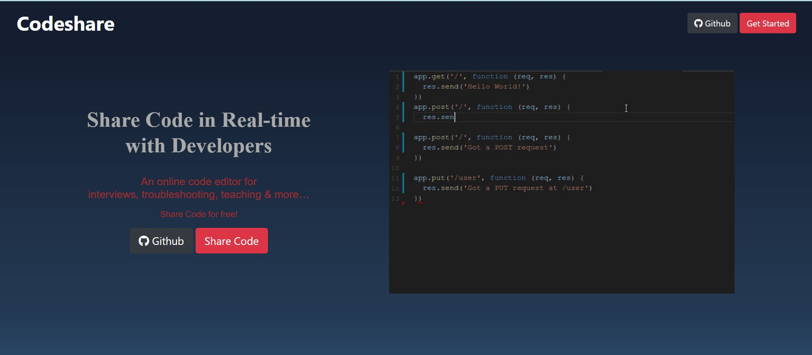
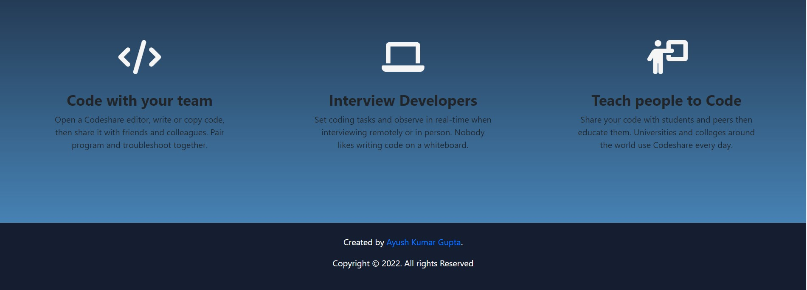
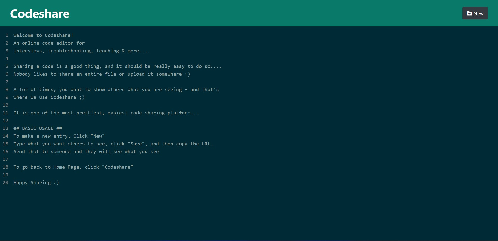
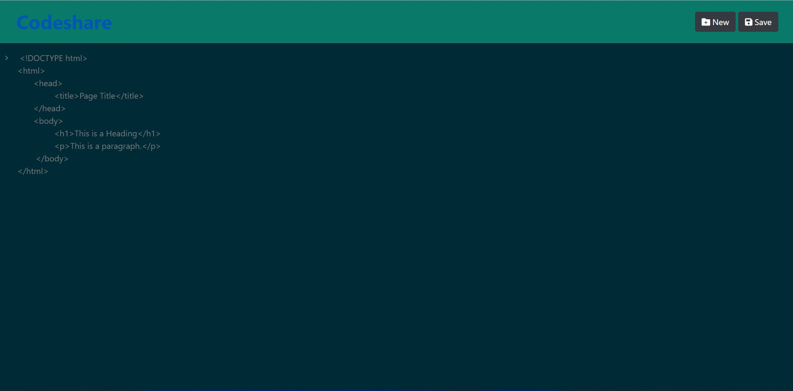
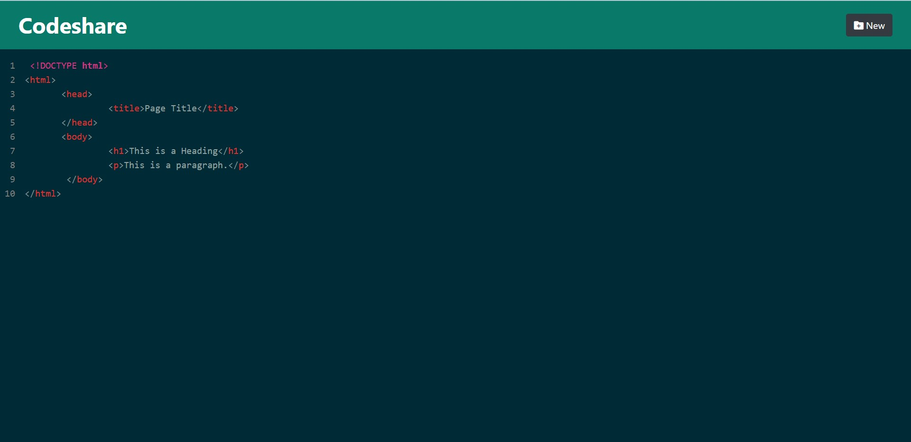

# Codeshare #

### Real-Time Code Sharing Platform ###

An online code sharing platform for interviews, troubleshooting, teaching & more ...    

Project can be viewed [here](https://limitless-mountain-02271.herokuapp.com/)

#### Features ####
- Creating and Saving new codes
- Sharing code by sharing the unique URL

#### To get Started and run the App Locally ####

```
$ git clone https://github.com/Ayush0202/Codeshare.git

$ cd Codeshare

$ npm install

$ nodemon server.js
```

#### Technologies Used ####

- **Frontend Technologies** - EJS, CSS
- **Backend Technologies** - Node.js, Express.js
- **Database** - MongoDB
- **Deployed Using** - Heroku

<br>






